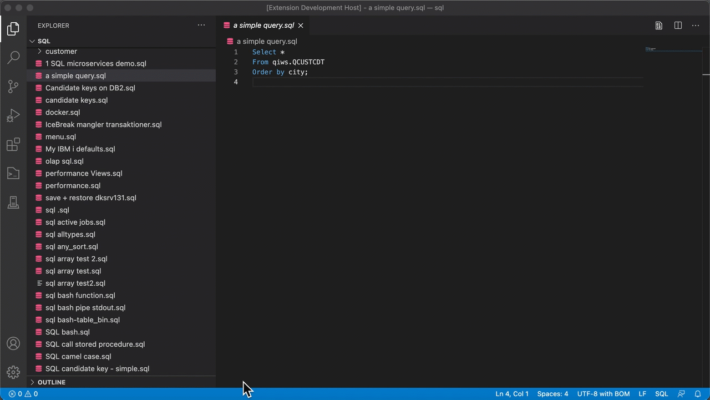

# IBM i - ACS Tools

Based on extension by [Niels Liisberg](https://github.com/NielsLiisberg/vscode-ibm-i-run-sql-with-acs)

## IBM i - ACS - Run SQL Scripts
This extension lets you use VSCode as the project explorer and lets you open and run any SQL file with IBM i Access Client solution (ACS). This gives you a perfect integration between VSCode and IBM i ACS. VSCode comes with loads of features like git and replace in files etc. - now with this extension it is all integrated.

### Demo


### Requirements

You need to install IBM i Access Client solution (ACS) on your win/mac/linux and the Java environment to run it - but you probably already have that up and running. After you have installed this extension, then click on setting and fill in the required parameters in your workspace:

#### The ACS binary file

Find the location of the the acsbundle.jar . If you installed it in the user folder "ibmiaccess", the complete path will then be:

`/usr/local/ibmiaccess/acsbundle.jar`

If you are using Windows, you can also use the Windows binary in the ACS product sub folder, `Start_Programs\Windows_x86-64\`, the complete path might look like `C:\Product\Location\Start_Programs\Windows_x86-64\acslaunch_win-64.exe`
 
#### The IBM i host 

This is the network name or TCP/IP address of you IBM i, defined in the host list in ACS. Separate the names of hosts by a comma: 
```
IBMI1,IBMI2 
```
And you can even have different hosts in either the workspace ( project specific) or defined by user ( user / global).

#### Default schema

The default schema ( library ) where tables, views etc will be created if you not fully qualify them



## IBM i - ACS - System Debugger
This tool allows you to gain access to the ACS System Debugger.  Useful, if you do not have RDi installed and you want to use a graphical debugger and you cannot use the debugger for VS Code. 

## IBM i - ACS - Performance Center
THis tool allows you to start the Performance Center.  If you are on later versions of ACS then you have quick access to the adviced indexes. 